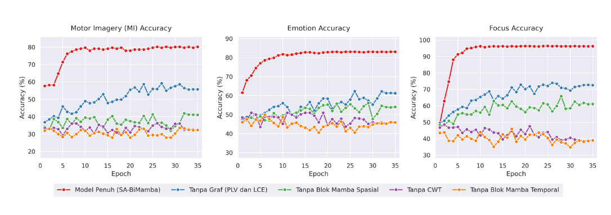
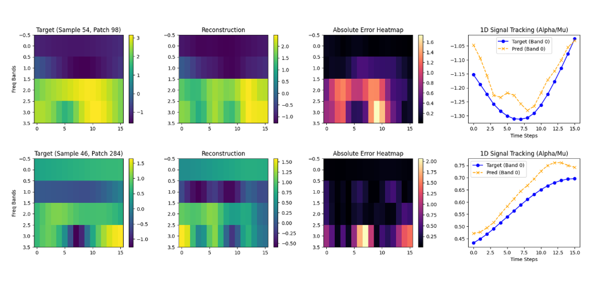
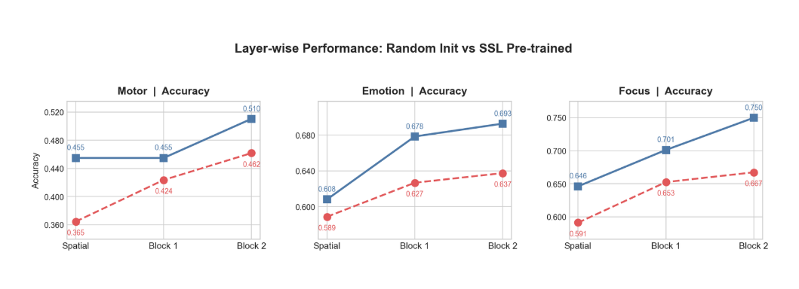

# Spatial Attention BiMamba for EEG Classification

## Author

**Putra Khaeran Shauma**

Computer Science Student  
Universitas Jenderal Achmad Yani

---

## Overview

This project presents an experimental deep learning architecture called **Spatial Attention BiMamba (SA-BiMamba)** for Electroencephalogram (EEG) signal classification.

The research focuses on analyzing EEG representations across three classification tasks:

- **Motor Imagery (MI)**
- **Emotion Recognition**
- **Cognitive Focus Classification**

The proposed approach combines spatial EEG representation, attention mechanisms, and Mamba-based sequence modeling to capture spatial and sequential information within EEG signals.

In addition to supervised classification, this research also explores **Self-Supervised Learning (SSL)** as a pre-training strategy for EEG representation learning through signal reconstruction.

This project was developed as part of a collaborative student research initiative under **Program Kreativitas Mahasiswa (PKM)**.

---

## Research Objectives

The main objectives of this research are:

1. Develop a deep learning architecture for EEG classification.
2. Explore spatial relationships between EEG channels.
3. Apply spatial attention to emphasize informative EEG representations.
4. Utilize Mamba-based modeling for EEG feature representation.
5. Evaluate architectural components through ablation experiments.
6. Explore Self-Supervised Learning for EEG representation pre-training.
7. Evaluate the learned representations across Motor Imagery, Emotion, and Focus classification tasks.

---

## Classification Tasks

The proposed architecture is evaluated across three EEG classification tasks:

| Task | Description |
|---|---|
| **Motor Imagery (MI)** | Classification of EEG patterns associated with imagined motor activity |
| **Emotion** | Classification of EEG signals associated with emotional states |
| **Focus** | Classification of EEG patterns associated with cognitive focus states |

---

## Methodology

The general experimental workflow consists of:

1. EEG dataset preparation
2. EEG signal preprocessing
3. Spatial and temporal representation
4. Spatial Attention processing
5. Mamba-based feature modeling
6. Classification
7. Self-Supervised Learning pre-training
8. Fine-tuning
9. Model validation
10. Ablation study
11. Performance evaluation

---

## Model Architecture

The proposed **Spatial Attention BiMamba (SA-BiMamba)** architecture is designed to model spatial and sequential characteristics of EEG signals.

The architecture incorporates several main components:

- EEG Input Representation
- Spatial Feature Processing
- Spatial Attention
- Spatial Mamba Block
- Temporal Mamba Block
- Feature Integration
- Classification Layers

### Spatial Attention

The **Spatial Attention** mechanism is designed to emphasize informative spatial relationships across EEG channels.

Since EEG signals are recorded from multiple electrodes positioned across different scalp regions, spatial modeling allows the architecture to learn relationships between channel-level representations.

### BiMamba

The BiMamba component is used for sequence modeling within the EEG representation.

The architecture aims to capture contextual dependencies within EEG signals while utilizing the sequence-modeling capabilities of Mamba-based architectures.

---

# Experimental Results

The proposed architecture was evaluated using multiple experimental analyses, including:

- Validation Accuracy
- Macro F1-Score
- Confusion Matrix
- Ablation Study
- Self-Supervised EEG Reconstruction
- Layer-wise SSL Pre-training Analysis

---

## Validation Performance

The fine-tuned model was evaluated across **Motor Imagery, Emotion, and Focus** classification tasks using validation Accuracy and Macro F1-Score.

### Validation Performance Summary

| Classification Task | Validation Accuracy | Macro F1-Score |
|---|---:|---:|
| **Motor Imagery** | ~71% | ~71% |
| **Emotion** | ~84% | ~84% |
| **Focus** | ~97% | ~97% |

> The values above are approximate values based on the final validation curves and may vary slightly between experimental runs.

### Validation Accuracy and Macro F1 Curves

<p align="center">
  
</p>

The visualization shows the validation performance across training epochs for all three EEG classification tasks.

The figure includes:

- Motor Imagery Accuracy
- Emotion Accuracy
- Focus Accuracy
- Motor Imagery Macro F1
- Emotion Macro F1
- Focus Macro F1

---

## Confusion Matrix Analysis

Confusion matrices were used to analyze class-level prediction performance after fine-tuning with SSL-based representations.

<p align="center">
  
</p>

The confusion matrices provide a detailed view of model predictions across the three classification tasks:

- **Motor Imagery**
- **Emotion**
- **Focus**

This analysis complements Accuracy and Macro F1-Score by showing the distribution of correct and incorrect predictions across individual classes.

---

## Ablation Study

An ablation study was conducted to investigate the contribution of individual components within the proposed **Spatial Attention BiMamba (SA-BiMamba)** architecture.

The full model was compared against several configurations in which specific components were removed.

The evaluated configurations include:

- **Full SA-BiMamba**
- Without Graph-based components (PLV and LCE)
- Without Spatial Mamba Block
- Without CWT
- Without Temporal Mamba Block

<p align="center">
  
</p>

The experiment compares the accuracy of each configuration across:

- Motor Imagery
- Emotion
- Focus

The ablation study provides insight into how individual components contribute to the overall classification performance of the architecture.

---

# Self-Supervised Learning

Self-Supervised Learning (SSL) was explored as a pre-training strategy for learning meaningful EEG representations before downstream classification.

The SSL experiments consist of two main analyses:

1. **EEG Signal Reconstruction**
2. **Layer-wise SSL Pre-training Evaluation**

---

## EEG Signal Reconstruction

During Self-Supervised Learning, the model learns EEG representations through a reconstruction objective.

The reconstruction experiment compares the original EEG representation against the reconstructed signal generated by the model.

<p align="center">
  
</p>

The visualization includes:

- **Target EEG representation**
- **Reconstructed EEG representation**
- **Absolute reconstruction error**
- **1D signal tracking between target and prediction**

The reconstruction objective encourages the model to learn structural information from EEG signals without directly relying on downstream classification labels.

---

## SSL Pre-training Analysis

To evaluate the representations learned through Self-Supervised Learning, layer-wise features from an **SSL pre-trained model** were compared against features obtained from a **randomly initialized model**.

The analysis evaluates representations at:

- Spatial Layer
- Block 1
- Block 2

across Motor Imagery, Emotion, and Focus classification tasks.

<p align="center">
  
</p>

### Layer-wise Accuracy Comparison

| Task | Layer | Random Initialization | SSL Pre-trained |
|---|---|---:|---:|
| **Motor Imagery** | Spatial | 36.5% | 45.5% |
| **Motor Imagery** | Block 1 | 42.4% | 45.5% |
| **Motor Imagery** | Block 2 | 46.2% | **51.0%** |
| **Emotion** | Spatial | 58.9% | 60.8% |
| **Emotion** | Block 1 | 62.7% | 67.8% |
| **Emotion** | Block 2 | 63.7% | **69.3%** |
| **Focus** | Spatial | 59.1% | 64.6% |
| **Focus** | Block 1 | 65.3% | 70.1% |
| **Focus** | Block 2 | 66.7% | **75.0%** |

Across the evaluated layers in these experiments, the SSL pre-trained representations produced higher downstream classification accuracy than the corresponding randomly initialized representations.

### Block 2 Comparison

| Classification Task | Random Init | SSL Pre-trained | Difference |
|---|---:|---:|---:|
| **Motor Imagery** | 46.2% | 51.0% | +4.8 pp |
| **Emotion** | 63.7% | 69.3% | +5.6 pp |
| **Focus** | 66.7% | 75.0% | +8.3 pp |

> `pp` represents percentage-point difference.

---

## Experimental Summary

The experiments analyze the proposed architecture from multiple perspectives.

| Experiment | Purpose |
|---|---|
| **Validation Accuracy** | Evaluate overall classification accuracy |
| **Macro F1-Score** | Evaluate classification performance across classes |
| **Confusion Matrix** | Analyze class-level prediction behavior |
| **Ablation Study** | Investigate contributions of individual architecture components |
| **SSL Reconstruction** | Evaluate self-supervised EEG representation learning |
| **Layer-wise SSL Analysis** | Compare SSL pre-training with random initialization |
| **Fine-tuning** | Evaluate learned representations on downstream EEG classification tasks |

---

## Technologies

The project involves:

- **Python**
- **Jupyter Notebook**
- **Artificial Intelligence**
- **Machine Learning**
- **Deep Learning**
- **Mamba / BiMamba**
- **Spatial Attention**
- **Self-Supervised Learning**
- **EEG Signal Processing**
- **Signal Reconstruction**
- **Brain-Computer Interface**

---

## Project Structure

```text
Spatial-Attention-Bimamba-EEG-Classification/
│
├── results/
│   ├── ablation_study_accuracy.png.png
│   ├── eeg_classification_confusion_matrices FINE TUNING with SSL.png.png
│   ├── ssl_eeg_signal_reconstruction.png.png
│   ├── ssl_pretraining_layerwise_performance.png.png
│   └── validaion_performance FINE TUNING with SSL.png
│
├── README.md
└── BiMamba_FINAL_v16.ipynb
```

### File Description

- `README.md` — Project documentation, methodology, and experimental results.
- `BiMamba_FINAL_v16.ipynb` — Main experimental notebook containing the model implementation, training, fine-tuning, and evaluation pipeline.
- `results/` — Experimental visualizations including validation performance, confusion matrices, ablation study, and SSL experiments.

---

## Project Context

This project was developed as part of a collaborative student research initiative under **Program Kreativitas Mahasiswa (PKM)**.

The research explores deep learning approaches for EEG signal analysis by combining:

- Spatial representation learning
- Attention mechanisms
- Mamba-based sequence modeling
- Self-Supervised Learning
- Fine-tuning for downstream EEG classification

This repository documents the experimental implementation and research process and is maintained as part of my academic and Artificial Intelligence / Machine Learning portfolio.

---

## Contribution

This research was conducted collaboratively as part of a student research team.

My involvement includes participation in the development, experimentation, implementation, and evaluation of the EEG classification research pipeline and the **Spatial Attention BiMamba** approach.

Individual contributions are presented within the context of a collaborative research project.

---

## Project Status

**Research / Experimental Project**

The repository represents the experimental implementation developed during the research process.

Further refinement, experimentation, and evaluation may be conducted as the research progresses.

---

## Research Areas

`EEG` · `Artificial Intelligence` · `Machine Learning` · `Deep Learning` · `Mamba` · `BiMamba` · `Spatial Attention` · `Self-Supervised Learning` · `Signal Processing` · `Brain-Computer Interface`

---

## Author

**Putra Khaeran Shauma**

Computer Science Student  
Universitas Jenderal Achmad Yani

**Interests:** Software Engineering · Artificial Intelligence · Machine Learning · Deep Learning
